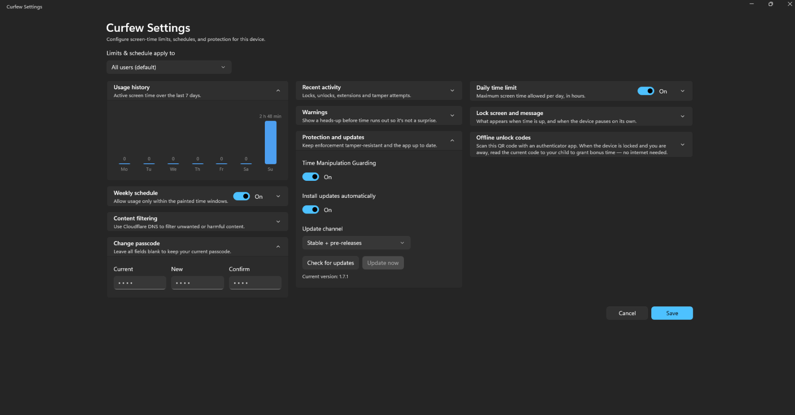

# Curfew

Parental screen time manager for Windows. Set daily limits - when time is up, the screen locks until you enter your passcode.

## Features

- Daily time limits per weekday, with an always-visible countdown timer
- Configurable warnings before time runs out
- Full-screen lock on all monitors, passcode-protected, with +15/30/60 min extensions
- Pause budget for breaks (45 min/day by default) and auto-pause when idle
- Optional shutdown countdown on the lock screen
- Automatic background updates (toggle in Settings; check manually from the tray)
- Clean Win11 dialogs that follow the system light/dark theme
- Survives restarts; runs as a system service

## Install

1. Download the latest installer from [Releases](https://github.com/beckervincent/curfew/releases).
2. Setup wizard will appear.

Requires Windows 11 (64-bit).

## Thanks

- [Simon Pamies (@spamsch)](https://github.com/spamsch)

## License

[MIT](LICENSE)
